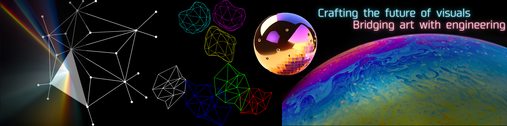
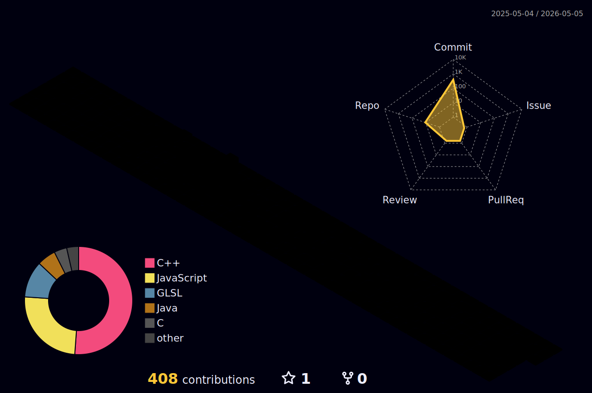

<p align="center">
  
</p>

```cpp
#include <iostream>

int main(int argc, char* argv[]) {
    std::cout << "Welcome to my Graphics Lab 🤓\n";
    return 0;
}

```

# Rendering dreams, one frame at a time ⬛🟥🟧🟨🟩🟦🟪⬜️
Because if you can imagine it, you can program it!

$$ e^{i \pi} + 1 = 0 $$

## My computational atelier 🖼️
<p align="center">
  <a href="https://skillicons.dev">
    
  </a>
</p>


