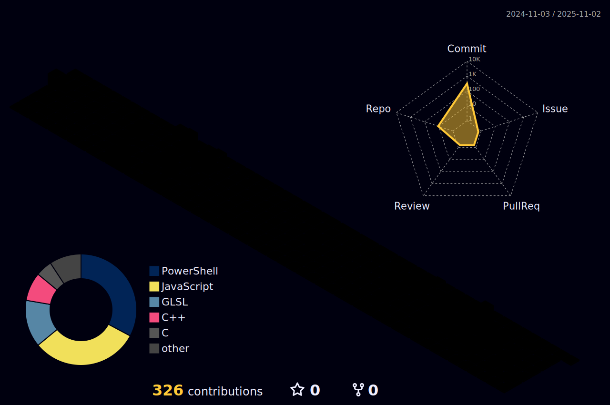

<p align="center">
  
</p>

```cpp
#include <iostream>

int main(int argc, char* argv[]) {
    std::cout << "Welcome to my Graphics Lab 🤓\n";
    std::cout << "Let's explore the art and science of rendering together!\n";
    return 0;
}

```

# Rendering dreams, one frame at a time ⬛🟥🟧🟨🟩🟦🟪⬜️
An artist in spirit and a technologist by craft, I shape the future of creativity by building the tools that transform imagination into breathtaking reality. My work lies at the intersection of art and science—bridging hardware and software in the realm of Render Engineering. Here, abstract mathematics takes form as high-performance graphics solutions, ensuring every pixel contributes to the story being told. As Alejandro Taboada once said, 'If you can imagine it, you can program it,' a reminder that the universe of creation is boundless for those who dare to explore.

$$ e^{i \pi} + 1 = 0 $$

## Painting with light and code: where dreams become pixels 🎨
### My digital brushes 🖌️
<p align="center">
  <a href="https://skillicons.dev">
    
  </a>
</p>


### My computational atelier 🖼️
<p align="center">
  <a href="https://skillicons.dev">
    
  </a>
</p>


